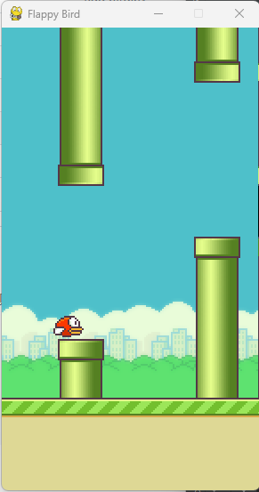

> Flay Bird Using Python



#### How 
Clone The Code：
```bash
git clone https://github.com/Codeory/py_flap_bird
```
Install Dependenci
```bash
pip install -r requirement.txt
```
Run
```bash
python main.py
```

